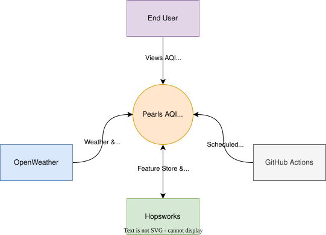
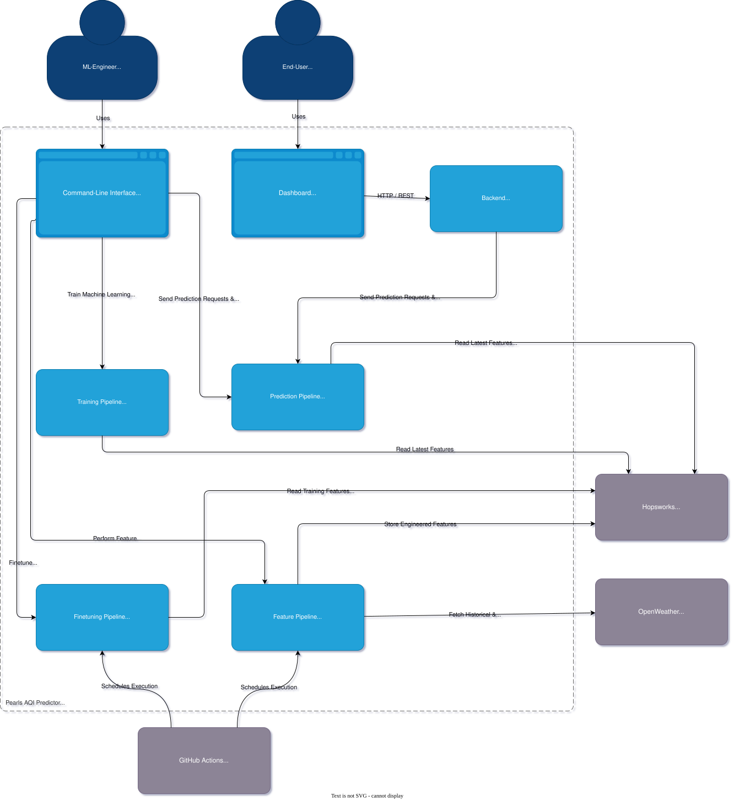
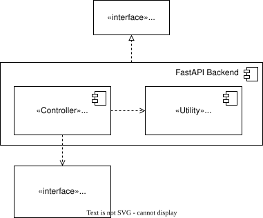
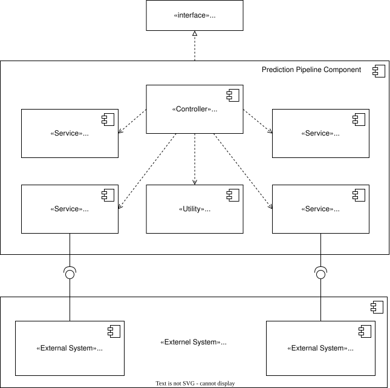
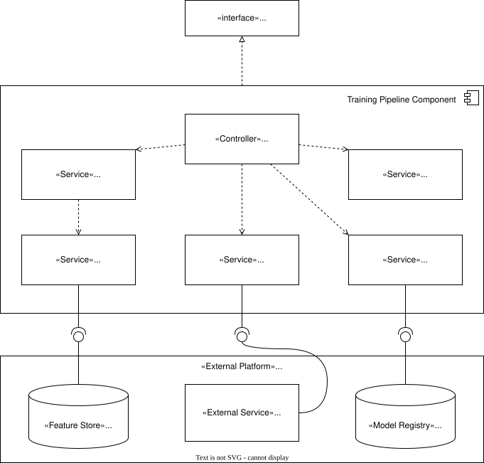

# 1. Introduction

This document describes the software architecture of the Pearls AQI Predictor system. It provides a high-level view of the system structure, identifies its major components, and explains how they interact to satisfy the requirements defined in the Software Requirements Specification (SRS).

The architecture is derived from the approved Architectural Decision Records (ADRs) and serves as the blueprint for the subsequent design and implementation phases. It defines the responsibilities of each subsystem, the flow of data through the machine learning pipeline, and the deployment strategy for the application.

This document does not describe implementation details such as algorithms, source code, or class structures. These will be specified during the detailed design phase.

---

# 2. Architectural Goals

The architecture of the Pearls AQI Predictor is designed to achieve the following goals:

## AG-001: Serverless Architecture

The system shall leverage managed cloud services where possible to minimize infrastructure management while supporting automated machine learning workflows.

## AG-002: Modular Design

The system shall separate data collection, feature engineering, model training, prediction, visualization, and workflow orchestration into independent components with clearly defined responsibilities.

## AG-003: Reproducibility

Machine learning experiments, datasets, features, and trained models shall be versioned to ensure reproducible training and prediction results.

## AG-004: Automation

Data collection, feature generation, model retraining, and deployment workflows shall execute automatically through scheduled workflows with minimal manual intervention.

## AG-005: Maintainability

System components shall be loosely coupled to simplify maintenance, testing, and future enhancements.

## AG-006: Explainability

The architecture shall support model interpretation by integrating SHAP-based explanations into the prediction workflow.

## AG-007: Scalability

Although the initial deployment targets a single city (Karachi), the architecture shall remain extensible to support additional locations and prediction models with minimal structural changes.

## AG-008: Traceability

Major architectural decisions shall be documented through ADRs, and architectural components shall be traceable to the requirements defined in the SRS.

---

# 3. Architectural Drivers

The architecture of the Pearls AQI Predictor is driven by the functional and non-functional requirements defined in the Software Requirements Specification (SRS), together with the architectural decisions documented in the project's ADRs.

## 3.1 Functional Drivers

The following functional requirements have the greatest influence on the system architecture:

| Requirement | Architectural Impact |
|-------------|----------------------|
| Automated data collection | Requires a scheduled data ingestion pipeline. |
| Feature engineering | Requires a dedicated feature processing component and Feature Store integration. |
| Model training | Requires an isolated training pipeline capable of producing versioned models. |
| Pollutant prediction | Requires independent prediction models for each target pollutant. |
| AQI calculation | Requires a post-processing component that derives AQI from predicted pollutant concentrations. |
| Explainability | Requires integration of SHAP into the prediction workflow. |
| Interactive dashboard | Requires a web-based presentation layer for visualization and user interaction. |

---

## 3.2 Quality Attribute Drivers

The architecture is designed to satisfy the following quality attributes:

| Quality Attribute | Architectural Impact |
|-------------------|----------------------|
| Reproducibility | Versioned datasets, features, experiments, and models. |
| Maintainability | Modular components with clearly defined responsibilities. |
| Reliability | Automated workflows with deterministic execution. |
| Performance | Efficient retrieval of features and models for prediction. |
| Usability | Simple web dashboard accessible through a browser. |

---

## 3.3 Architectural Constraints

The following constraints have been established during project planning:

| Constraint | Impact |
|------------|--------|
| Serverless architecture | Managed cloud services shall be preferred over self-managed infrastructure. |
| OpenWeather API | Environmental data shall be obtained from OpenWeather. |
| Hopsworks | Feature storage and model registry shall be provided by Hopsworks. |
| GitHub Actions | Workflow automation shall be implemented using GitHub Actions. |
| FastAPI | Backend services shall expose prediction functionality through FastAPI. |
| Streamlit | The user interface shall be implemented using Streamlit. |
| PyTorch | Deep learning models shall be implemented using PyTorch. |

---

## 3.4 Architectural Decision Records

The architecture is guided by the following approved Architectural Decision Records:

| ADR | Summary |
|-----|---------|
| ADR-001 | Predict AQI by deriving it from predicted pollutant concentrations. |
| ADR-002 | Perform forecasting at hourly granularity. |
| ADR-003 | Use OpenWeather as the environmental data provider. |
| ADR-004 | Train one prediction model per pollutant. |
| ADR-005 | Use Hopsworks as the Feature Store and Model Registry. |
| ADR-006 | Use GitHub Actions for workflow automation. |
| ADR-007 | Use FastAPI as the backend framework. |

---

# 4. System Context

The Pearls AQI Predictor operates within a broader ecosystem of external users and cloud services. At the highest level, the system collects environmental observations from OpenWeather, stores machine learning assets in Hopsworks, executes scheduled workflows using GitHub Actions, and provides AQI forecasts to end users through a web dashboard.

The system boundary consists of all software developed as part of the Pearls AQI Predictor. External services communicate with the system through well-defined interfaces and are not considered part of the application architecture.

**Figure 4.1.** System Context Diagram showing the external actors and services interacting with the Pearls AQI Predictor.

---

# 5. Container Architecture

The Pearls AQI Predictor consists of several independently deployable containers, each responsible for a specific aspect of the machine learning workflow. These containers communicate through well-defined interfaces and shared cloud services.

The architecture is organized into three primary workflows:

- Feature Pipeline
- Training Pipeline
- Prediction Pipeline

Supporting these workflows are the FastAPI backend, Streamlit dashboard, Hopsworks Feature Store and Model Registry, OpenWeather API, and GitHub Actions for workflow orchestration.

Separating these responsibilities improves maintainability, reproducibility, and scalability while allowing each workflow to execute independently according to its own schedule.

**Figure 5.1.** Container Diagram showing the major containers within the Pearls AQI Predictor, including the Dashboard, Backend, Feature Pipeline, Prediction Pipeline, and Training Pipeline, along with their interactions with external services such as OpenWeather, Hopsworks, and GitHub Actions.

---

# 6. Component Architecture

The component architecture decomposes the major application containers into their internal software components and illustrates the relationships between them.

## 6.1 FastAPI Backend Component Diagram

**Figure 6.1.** FastAPI Backend Component Diagram showing the internal components responsible for handling API requests, formatting responses, and communicating with the prediction pipeline service.

---

## 6.2 Prediction Pipeline Component Diagram

The Prediction Pipeline is responsible for executing the AQI prediction workflow after receiving a prediction request from the backend API. It coordinates feature retrieval, model inference, explainability generation, AQI computation, and response formatting through a centralized orchestration component.

The Prediction Pipeline follows an orchestrator-based design where individual services remain loosely coupled. The Pipeline Orchestrator manages communication between components and provides the required prediction context to downstream services such as the SHAP Explainer and AQI Calculator.

**Figure 6.2.** Prediction Pipeline Component Diagram showing the internal components responsible for feature retrieval, model inference, explainability generation, AQI calculation, and prediction response formatting. The Pipeline Orchestrator coordinates interactions between these components and external services including the Hopsworks Feature Store and Model Registry.

### Prediction Pipeline Components

#### Pipeline Orchestrator

The Pipeline Orchestrator acts as the central coordination component of the prediction workflow. It manages the execution sequence and communication between prediction services.

Responsibilities include:

- Initiating prediction workflows.
- Coordinating feature retrieval and model inference.
- Passing prediction context to explainability and post-processing services.
- Aggregating prediction outputs before response formatting.

#### Feature Retriever

The Feature Retriever obtains required input features from the Feature Store.

It communicates with the Hopsworks Feature Store and provides standardized feature inputs to the prediction workflow.

#### Inference Engine

The Inference Engine performs model inference using the trained prediction models.

It retrieves model artifacts through the Hopsworks Model Registry and generates pollutant concentration predictions.

#### SHAP Explainer

The SHAP Explainer generates feature contribution explanations for model predictions.

The component receives prediction context from the Pipeline Orchestrator instead of directly depending on the Inference Engine, maintaining loose coupling between prediction execution and explainability generation.

#### AQI Calculator

The AQI Calculator derives the final AQI value from predicted pollutant concentrations according to the defined AQI calculation rules.

#### Prediction Formatter

The Prediction Formatter prepares the final prediction response by combining:

- Pollutant predictions.
- AQI results.
- SHAP explanations.

The formatted response is returned through the Prediction Pipeline API.

---

## 6.3 Training Pipeline Component Diagram

The Training Pipeline is responsible for constructing training datasets, training pollutant prediction models, evaluating model performance, and registering approved models for deployment. The workflow is coordinated by the Pipeline Orchestrator, which manages the complete training lifecycle.

**Pipeline Orchestrator**

The Pipeline Orchestrator begins a training run through the Training Pipeline Interface. It coordinates dataset construction, model training, model evaluation, and model registration while interacting with external machine learning services.

**Dataset Builder**

The Dataset Builder prepares training datasets by requesting historical feature data from the Training Feature Retriever, which retrieves the required records from the Hopsworks Feature Store.

**Model Trainer**

The Model Trainer trains pollutant-specific prediction models using the prepared datasets and records experiment metadata, metrics, and artifacts in the MLflow Tracking Server.

**Model Evaluator**

The Model Evaluator assesses the performance of newly trained models. During evaluation, the Pipeline Orchestrator retrieves the currently registered production models through the Model Registrar, enabling comparison between newly trained models and existing deployed models.

Following evaluation, the Pipeline Orchestrator instructs the Model Registrar to register or promote approved models within the Hopsworks Model Registry.

Separating training, evaluation, registration, and experiment tracking into dedicated components improves maintainability, reproducibility, and extensibility while supporting automated model lifecycle management.

**Figure 6.3.** Training Pipeline Component Diagram showing the internal components responsible for dataset construction, feature retrieval, model training, evaluation, experiment tracking, and model registration, together with their interactions with the Hopsworks Feature Store, Hopsworks Model Registry, and MLflow Tracking Server.