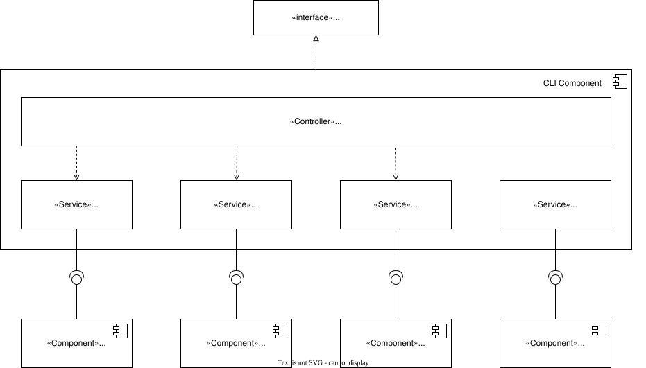

# System Architecture

**Project:** Pearls AQI Predictor

**Version:** 1.1

**Date:** 2026-07-23

---

# Table of Contents

- [System Architecture](#system-architecture)
- [Table of Contents](#table-of-contents)
- [1. Introduction](#1-introduction)
- [2. Architectural Goals](#2-architectural-goals)
  - [AG-001: Serverless Architecture](#ag-001-serverless-architecture)
  - [AG-002: Modular Design](#ag-002-modular-design)
  - [AG-003: Reproducibility](#ag-003-reproducibility)
  - [AG-004: Automation](#ag-004-automation)
  - [AG-005: Maintainability](#ag-005-maintainability)
  - [AG-006: Explainability](#ag-006-explainability)
  - [AG-007: Scalability](#ag-007-scalability)
  - [AG-008: Traceability](#ag-008-traceability)
- [3. Architectural Drivers](#3-architectural-drivers)
  - [3.1 Functional Drivers](#31-functional-drivers)
  - [3.2 Quality Attribute Drivers](#32-quality-attribute-drivers)
  - [3.3 Architectural Constraints](#33-architectural-constraints)
  - [3.4 Architectural Decision Records](#34-architectural-decision-records)
- [4. System Context](#4-system-context)
- [5. Container Architecture](#5-container-architecture)
- [6. Component Architecture](#6-component-architecture)
  - [6.1 Command-Line Interface (CLI) Component Diagram](#61-command-line-interface-cli-component-diagram)
  - [6.2 FastAPI Backend Component Diagram](#62-fastapi-backend-component-diagram)
  - [6.3 Prediction Pipeline Component Diagram](#63-prediction-pipeline-component-diagram)
    - [Prediction Pipeline Components](#prediction-pipeline-components)
      - [Pipeline Orchestrator](#pipeline-orchestrator)
      - [Feature Retriever](#feature-retriever)
      - [Inference Engine](#inference-engine)
      - [SHAP Explainer](#shap-explainer)
      - [AQI Calculator](#aqi-calculator)
      - [Prediction Formatter](#prediction-formatter)
  - [6.4 Training \& Finetuning Pipeline Component Diagram](#64-training--finetuning-pipeline-component-diagram)
  - [6.5 Feature Pipeline Component Diagram](#65-feature-pipeline-component-diagram)
  - [6.6 Dashboard Component Diagram](#66-dashboard-component-diagram)
  - [6.7 Prediction Data Flow Diagram](#67-prediction-data-flow-diagram)
  - [6.8 Deployment Diagram](#68-deployment-diagram)

---

# 1. Introduction

This document describes the software architecture of the Pearls AQI Predictor system. It provides a high-level view of the system structure, identifies its major components, and explains how they interact to satisfy the requirements defined in the Software Requirements Specification (SRS).

The architecture is derived from the approved Architectural Decision Records (ADRs) and serves as the blueprint for the subsequent design and implementation phases. It defines the responsibilities of each subsystem, the flow of data through the machine learning pipeline, and the deployment strategy for the application.

This document does not describe implementation details such as algorithms, source code, or class structures. These will be specified during the detailed design phase.

---

# 2. Architectural Goals

The architecture of the Pearls AQI Predictor is designed to achieve the following goals:

## AG-001: Serverless Architecture

The system shall leverage managed cloud services where possible to minimize infrastructure management while supporting automated machine learning workflows.

## AG-002: Modular Design

The system shall separate data collection, feature engineering, first-time model training, model finetuning, prediction, visualization, CLI execution, and workflow orchestration into independent components with clearly defined responsibilities.

## AG-003: Reproducibility

Machine learning experiments, datasets, features, and trained models shall be versioned to ensure reproducible training and prediction results.

## AG-004: Automation

Data collection, feature generation, model fine-tuning, and deployment workflows shall execute automatically through scheduled workflows with minimal manual intervention.

## AG-005: Maintainability

System components shall be loosely coupled to simplify maintenance, testing, and future enhancements.

## AG-006: Explainability

The architecture shall support model interpretation by integrating SHAP-based explanations into the prediction workflow.

## AG-007: Scalability

Although the initial deployment targets a single city (Karachi), the architecture shall remain extensible to support additional locations and prediction models with minimal structural changes.

## AG-008: Traceability

Major architectural decisions shall be documented through ADRs, and architectural components shall be traceable to the requirements defined in the SRS.

---

# 3. Architectural Drivers

The architecture of the Pearls AQI Predictor is driven by the functional and non-functional requirements defined in the Software Requirements Specification (SRS), together with the architectural decisions documented in the project's ADRs.

## 3.1 Functional Drivers

The following functional requirements have the greatest influence on the system architecture:

| Requirement | Architectural Impact |
|-------------|----------------------|
| Automated data collection | Requires a scheduled data ingestion pipeline. |
| Feature engineering | Requires a dedicated feature processing component and Feature Store integration. |
| Initial Model Training | Requires a first-time training pipeline capable of building models from scratch. |
| Model Finetuning | Requires a scheduled finetuning pipeline for iterative retraining on new observations. |
| Pollutant prediction | Requires independent prediction models for each target pollutant. |
| AQI calculation | Requires a post-processing component that derives AQI from predicted pollutant concentrations. |
| Developer & Operational CLI | Requires a Command-Line Interface (CLI) layer for offline training, manual predictions, testing, and feature triggers by ML Engineers. |
| Explainability | Requires integration of SHAP into the prediction workflow. |
| Interactive dashboard | Requires a web-based presentation layer for visualization and user interaction. |

---

## 3.2 Quality Attribute Drivers

The architecture is designed to satisfy the following quality attributes:

| Quality Attribute | Architectural Impact |
|-------------------|----------------------|
| Reproducibility | Versioned datasets, features, experiments, and models. |
| Maintainability | Modular components with clearly defined responsibilities. |
| Reliability | Automated workflows with deterministic execution. |
| Performance | Efficient retrieval of features and models for prediction. |
| Usability | Simple web dashboard accessible through a browser and direct CLI commands for engineers. |

---

## 3.3 Architectural Constraints

The following constraints have been established during project planning:

| Constraint | Impact |
|------------|--------|
| Serverless architecture | Managed cloud services shall be preferred over self-managed infrastructure. |
| OpenWeather API | Environmental data shall be obtained from OpenWeather. |
| Hopsworks | Feature storage and model registry shall be provided by Hopsworks. |
| GitHub Actions | Scheduled workflow automation shall be implemented using GitHub Actions. |
| FastAPI | Backend services shall expose prediction functionality through FastAPI. |
| Streamlit | The user interface shall be implemented using Streamlit. |
| PyTorch / Scikit-Learn | Deep learning and machine learning models shall be implemented using PyTorch and Scikit-Learn. |
| CLI (Bash/Python) | CLI commands shall be provided for direct operational and offline pipeline management. |

---

## 3.4 Architectural Decision Records

The architecture is guided by the following approved Architectural Decision Records:

| ADR | Summary |
|-----|---------|
| ADR-001 | Predict AQI by deriving it from predicted pollutant concentrations. |
| ADR-002 | Perform forecasting at hourly granularity. |
| ADR-003 | Use OpenWeather as the environmental data provider. |
| ADR-004 | Train one prediction model per pollutant. |
| ADR-005 | Use Hopsworks as the Feature Store and Model Registry. |
| ADR-006 | Use GitHub Actions for workflow automation. |
| ADR-007 | Use FastAPI as the backend framework. |
| ADR-008 | Implement a CLI layer for offline testing, initial training, and feature engineering triggers. |

---

# 4. System Context

The Pearls AQI Predictor operates within a broader ecosystem of external human actors (End-Users and ML-Engineers) and cloud services. At the highest level:

- **End-Users** interact with the web **Dashboard** to view AQI forecasts and pollutant trends.
- **ML-Engineers** use the **Command-Line Interface (CLI)** to execute offline training, model evaluations, manual feature engineering, and offline predictions.
- **OpenWeather API** provides raw historical and forecast weather/pollutant observations.
- **Hopsworks** stores engineered features (Feature Store) and versioned models (Model Registry).
- **GitHub Actions** automates scheduled executions of the feature and finetuning pipelines.

**Figure 4.1.** System Context Diagram showing the external actors and services interacting with the Pearls AQI Predictor.

---

# 5. Container Architecture

The Pearls AQI Predictor consists of several independently executable and deployable containers, each responsible for a specific aspect of the machine learning workflow.

The architecture is organized into the following main containers/subsystems:

- **Command-Line Interface (CLI)**: Bash/Python CLI container enabling ML-Engineers to trigger training from scratch, model finetuning, feature engineering, and offline prediction commands.
- **Dashboard**: Streamlit container providing end-users interactive visualization of AQI and pollutant trends.
- **Backend**: FastAPI Python backend serving prediction requests and loading production models.
- **Feature Pipeline**: Python-based scheduled ETL pipeline fetching data from OpenWeather, engineering features, and pushing them to Hopsworks.
- **Training Pipeline**: Python container responsible for training pollutant forecasting models **from scratch** on initial dataset versions and registering initial artifacts in Hopsworks.
- **Finetuning Pipeline**: Scheduled container responsible for **finetuning** existing pollutant models on incoming feature store updates and updating the model registry.
- **Prediction Pipeline**: Python, Scikit-learn, and PyTorch runtime container executing real-time inference using production features and models.
- **Hopsworks & GitHub Actions**: Managed external services for feature/model storage and automated scheduled pipeline orchestration.

**Figure 5.1.** Container Diagram showing the major containers within the Pearls AQI Predictor, including the Command-Line Interface, Dashboard, Backend, Feature Pipeline, First-Time Training Pipeline, Finetuning Pipeline, and Prediction Pipeline.

---

# 6. Component Architecture

The component architecture decomposes the major application containers into their internal software components and illustrates the relationships between them.

---

## 6.1 Command-Line Interface (CLI) Component Diagram

The CLI Layer acts as the operational and developer interface for Machine Learning Engineers. It allows direct interaction with the system without needing the web backend or dashboard.

Responsibilities include:
- Executing first-time model training from scratch via the **Training Pipeline**.
- Triggering model finetuning runs via the **Finetuning Pipeline**.
- Triggering manual feature engineering and extraction via the **Feature Pipeline**.
- Sending direct prediction requests and retrieving forecast results via the **Prediction Pipeline**.

**Figure 6.1.** CLI Component Diagram showing the internal command parsers, execution engines, and communication endpoints interfacing with backend pipelines and Hopsworks.

---

## 6.2 FastAPI Backend Component Diagram

**Figure 6.2.** FastAPI Backend Component Diagram showing the internal components responsible for handling API requests, formatting responses, and communicating with the prediction pipeline service.

---

## 6.3 Prediction Pipeline Component Diagram

The Prediction Pipeline is responsible for executing the AQI prediction workflow after receiving a prediction request from either the FastAPI backend API or the CLI Layer. It coordinates feature retrieval, model inference, explainability generation, AQI computation, and response formatting through a centralized orchestration component.

**Figure 6.3.** Prediction Pipeline Component Diagram showing the internal components responsible for feature retrieval, model inference, explainability generation, AQI calculation, and prediction response formatting.

### Prediction Pipeline Components

#### Pipeline Orchestrator

The Pipeline Orchestrator acts as the central coordination component of the prediction workflow. It manages the execution sequence and communication between prediction services.

#### Feature Retriever

The Feature Retriever obtains required input features from the Feature Store hosted on Hopsworks.

#### Inference Engine

The Inference Engine performs model inference using the trained prediction models (PyTorch / Scikit-Learn). It retrieves model artifacts through the Hopsworks Model Registry.

#### SHAP Explainer

The SHAP Explainer generates feature contribution explanations for model predictions.

#### AQI Calculator

The AQI Calculator derives the final AQI value from predicted pollutant concentrations according to domain calculation rules.

#### Prediction Formatter

The Prediction Formatter prepares the final prediction response by combining pollutant predictions, AQI results, and SHAP explanations.

---

## 6.4 Training & Finetuning Pipeline Component Diagram

The system maintains a clear separation between initial **first-time model training** and automated **model finetuning**:

1. **First-Time Training Pipeline**:
   - Triggered via the **CLI** by an ML Engineer.
   - Responsible for building pollutant forecasting models **from scratch** using raw historical baseline datasets and initial feature sets.
   - Registers baseline model artifacts and metrics into the **Hopsworks Model Registry**.

2. **Finetuning Pipeline**:
   - Automated via **GitHub Actions** (or manually via CLI).
   - Reads the latest training features from the **Hopsworks Feature Store**.
   - Finetunes existing models with newly ingested data observations and updates model versions in the **Hopsworks Model Registry**.

**Figure 6.4.** Training and Finetuning Pipeline Component Diagram showing how the First-Time Training Pipeline (from scratch) and Finetuning Pipeline interact with the CLI, GitHub Actions, Feature Store, and Model Registry.

---

## 6.5 Feature Pipeline Component Diagram

The Feature Pipeline is responsible for acquiring raw weather observations from the OpenWeather API, transforming them into machine learning features, validating the generated feature set, and storing validated features in the Hopsworks Feature Store. It can be triggered automatically via **GitHub Actions** or manually via the **CLI**.

**Figure 6.5.** Feature Pipeline Component Diagram showing interactions with OpenWeather and the Hopsworks Feature Store.

---

## 6.6 Dashboard Component Diagram

The Dashboard Component processes user requests, retrieves historical metrics, queries model inference endpoints, and serves transformed analytical data to the user interface.

**Figure 6.6.** Dashboard Component Diagram showing internal presentation services and communication with the FastAPI Backend.

---

## 6.7 Prediction Data Flow Diagram

The Prediction Data Flow Diagram illustrates how inference requests travel through the system—either from an **End-User** via the Dashboard and FastAPI Backend, or from an **ML-Engineer** via the CLI container.

**Figure 6.7.** Prediction Data Flow Diagram showing request pathways through Backend/CLI, Feature Store fetching, Model Registry loading, and inference execution with SHAP explanations.

---

## 6.8 Deployment Diagram

The Deployment Diagram illustrates the physical deployment of the Air Quality Prediction System across its execution environments and external services.

- **User Client Device**: Browser accessing Streamlit Dashboard over HTTPS.
- **Developer / Operational Workstation**: Terminal executing CLI container commands.
- **Cloud Application Server**: Hosts Streamlit Dashboard, FastAPI Backend, and the Prediction Pipeline runtime.
- **GitHub Actions Runner**: Executes scheduled Feature Ingestion and Model Finetuning workflows.
- **Hopsworks Platform**: Managed cloud Feature Store and Model Registry.
- **OpenWeather Services**: External REST API providing weather and air quality observations.

**Figure 6.8.** Deployment Diagram showing the physical infrastructure and communication channels across all runtime environments.