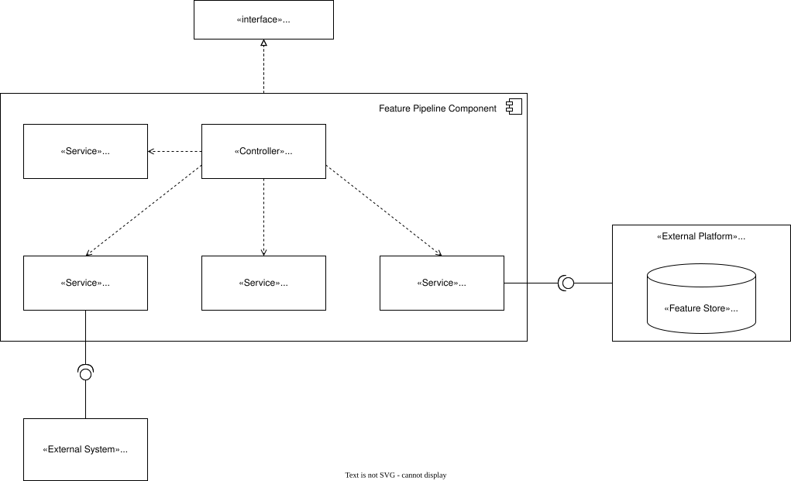
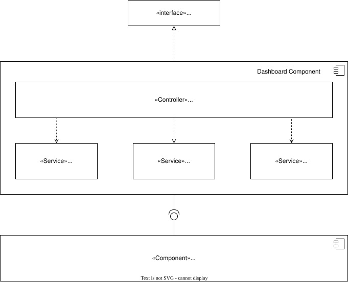
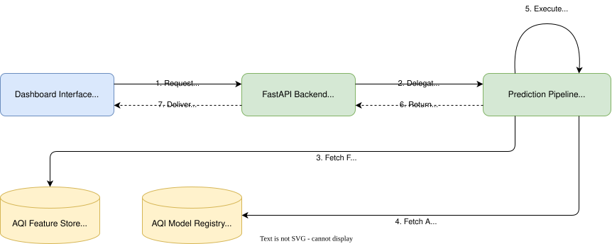
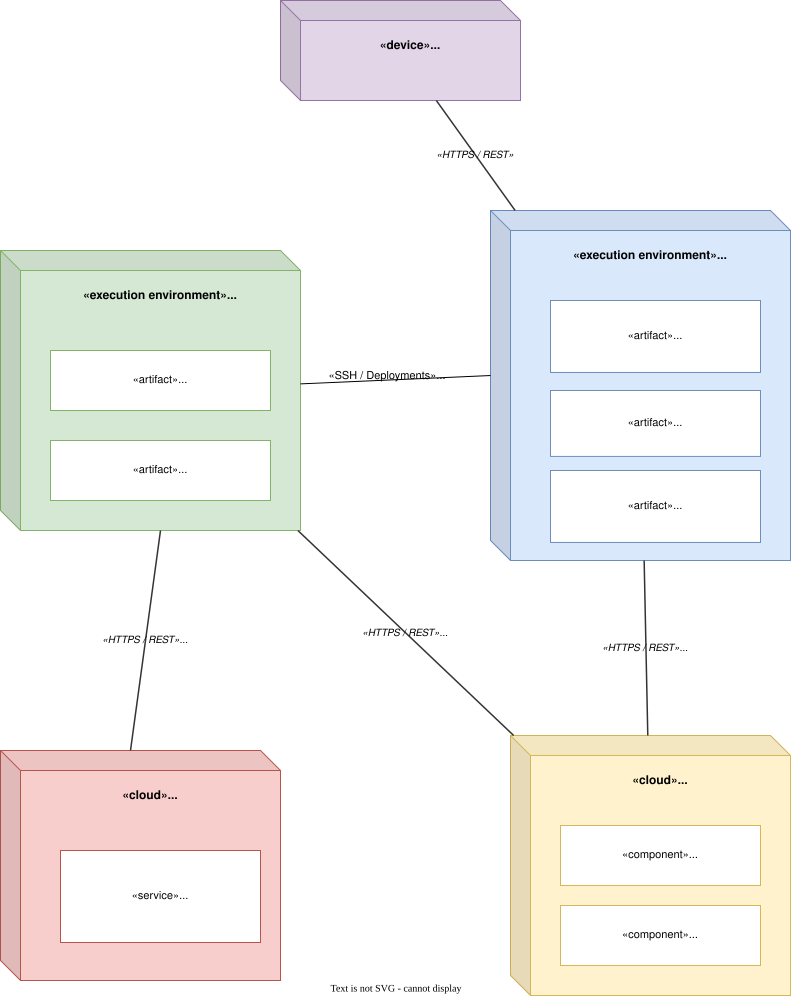

# System Architecture

**Project:** Pearls AQI Predictor

**Version:** 1.0

**Date:** 2026-07-23

---

- [System Architecture](#system-architecture)
- [1. Introduction](#1-introduction)
- [2. Architectural Goals](#2-architectural-goals)
  - [AG-001: Serverless Architecture](#ag-001-serverless-architecture)
  - [AG-002: Modular Design](#ag-002-modular-design)
  - [AG-003: Reproducibility](#ag-003-reproducibility)
  - [AG-004: Automation](#ag-004-automation)
  - [AG-005: Maintainability](#ag-005-maintainability)
  - [AG-006: Explainability](#ag-006-explainability)
  - [AG-007: Scalability](#ag-007-scalability)
  - [AG-008: Traceability](#ag-008-traceability)
- [3. Architectural Drivers](#3-architectural-drivers)
  - [3.1 Functional Drivers](#31-functional-drivers)
  - [3.2 Quality Attribute Drivers](#32-quality-attribute-drivers)
  - [3.3 Architectural Constraints](#33-architectural-constraints)
  - [3.4 Architectural Decision Records](#34-architectural-decision-records)
- [4. System Context](#4-system-context)
- [5. Container Architecture](#5-container-architecture)
- [6. Component Architecture](#6-component-architecture)
  - [6.1 FastAPI Backend Component Diagram](#61-fastapi-backend-component-diagram)
  - [6.2 Prediction Pipeline Component Diagram](#62-prediction-pipeline-component-diagram)
    - [Prediction Pipeline Components](#prediction-pipeline-components)
      - [Pipeline Orchestrator](#pipeline-orchestrator)
      - [Feature Retriever](#feature-retriever)
      - [Inference Engine](#inference-engine)
      - [SHAP Explainer](#shap-explainer)
      - [AQI Calculator](#aqi-calculator)
      - [Prediction Formatter](#prediction-formatter)
  - [6.3 Training Pipeline Component Diagram](#63-training-pipeline-component-diagram)
  - [6.4 Feature Pipeline Component Diagram](#64-feature-pipeline-component-diagram)
  - [6.5 Dashboard Component Diagram](#65-dashboard-component-diagram)
  - [6.6 Prediction Data Flow Diagram](#66-prediction-data-flow-diagram)
  - [6.5 Deployment Diagram](#65-deployment-diagram)

---

# 1. Introduction

This document describes the software architecture of the Pearls AQI Predictor system. It provides a high-level view of the system structure, identifies its major components, and explains how they interact to satisfy the requirements defined in the Software Requirements Specification (SRS).

The architecture is derived from the approved Architectural Decision Records (ADRs) and serves as the blueprint for the subsequent design and implementation phases. It defines the responsibilities of each subsystem, the flow of data through the machine learning pipeline, and the deployment strategy for the application.

This document does not describe implementation details such as algorithms, source code, or class structures. These will be specified during the detailed design phase.

---

# 2. Architectural Goals

The architecture of the Pearls AQI Predictor is designed to achieve the following goals:

## AG-001: Serverless Architecture

The system shall leverage managed cloud services where possible to minimize infrastructure management while supporting automated machine learning workflows.

## AG-002: Modular Design

The system shall separate data collection, feature engineering, model training, prediction, visualization, and workflow orchestration into independent components with clearly defined responsibilities.

## AG-003: Reproducibility

Machine learning experiments, datasets, features, and trained models shall be versioned to ensure reproducible training and prediction results.

## AG-004: Automation

Data collection, feature generation, model retraining, and deployment workflows shall execute automatically through scheduled workflows with minimal manual intervention.

## AG-005: Maintainability

System components shall be loosely coupled to simplify maintenance, testing, and future enhancements.

## AG-006: Explainability

The architecture shall support model interpretation by integrating SHAP-based explanations into the prediction workflow.

## AG-007: Scalability

Although the initial deployment targets a single city (Karachi), the architecture shall remain extensible to support additional locations and prediction models with minimal structural changes.

## AG-008: Traceability

Major architectural decisions shall be documented through ADRs, and architectural components shall be traceable to the requirements defined in the SRS.

---

# 3. Architectural Drivers

The architecture of the Pearls AQI Predictor is driven by the functional and non-functional requirements defined in the Software Requirements Specification (SRS), together with the architectural decisions documented in the project's ADRs.

## 3.1 Functional Drivers

The following functional requirements have the greatest influence on the system architecture:

| Requirement | Architectural Impact |
|-------------|----------------------|
| Automated data collection | Requires a scheduled data ingestion pipeline. |
| Feature engineering | Requires a dedicated feature processing component and Feature Store integration. |
| Model training | Requires an isolated training pipeline capable of producing versioned models. |
| Pollutant prediction | Requires independent prediction models for each target pollutant. |
| AQI calculation | Requires a post-processing component that derives AQI from predicted pollutant concentrations. |
| Explainability | Requires integration of SHAP into the prediction workflow. |
| Interactive dashboard | Requires a web-based presentation layer for visualization and user interaction. |

---

## 3.2 Quality Attribute Drivers

The architecture is designed to satisfy the following quality attributes:

| Quality Attribute | Architectural Impact |
|-------------------|----------------------|
| Reproducibility | Versioned datasets, features, experiments, and models. |
| Maintainability | Modular components with clearly defined responsibilities. |
| Reliability | Automated workflows with deterministic execution. |
| Performance | Efficient retrieval of features and models for prediction. |
| Usability | Simple web dashboard accessible through a browser. |

---

## 3.3 Architectural Constraints

The following constraints have been established during project planning:

| Constraint | Impact |
|------------|--------|
| Serverless architecture | Managed cloud services shall be preferred over self-managed infrastructure. |
| OpenWeather API | Environmental data shall be obtained from OpenWeather. |
| Hopsworks | Feature storage and model registry shall be provided by Hopsworks. |
| GitHub Actions | Workflow automation shall be implemented using GitHub Actions. |
| FastAPI | Backend services shall expose prediction functionality through FastAPI. |
| Streamlit | The user interface shall be implemented using Streamlit. |
| PyTorch | Deep learning models shall be implemented using PyTorch. |

---

## 3.4 Architectural Decision Records

The architecture is guided by the following approved Architectural Decision Records:

| ADR | Summary |
|-----|---------|
| ADR-001 | Predict AQI by deriving it from predicted pollutant concentrations. |
| ADR-002 | Perform forecasting at hourly granularity. |
| ADR-003 | Use OpenWeather as the environmental data provider. |
| ADR-004 | Train one prediction model per pollutant. |
| ADR-005 | Use Hopsworks as the Feature Store and Model Registry. |
| ADR-006 | Use GitHub Actions for workflow automation. |
| ADR-007 | Use FastAPI as the backend framework. |

---

# 4. System Context

The Pearls AQI Predictor operates within a broader ecosystem of external users and cloud services. At the highest level, the system collects environmental observations from OpenWeather, stores machine learning assets in Hopsworks, executes scheduled workflows using GitHub Actions, and provides AQI forecasts to end users through a web dashboard.

The system boundary consists of all software developed as part of the Pearls AQI Predictor. External services communicate with the system through well-defined interfaces and are not considered part of the application architecture.

**Figure 4.1.** System Context Diagram showing the external actors and services interacting with the Pearls AQI Predictor.

---

# 5. Container Architecture

The Pearls AQI Predictor consists of several independently deployable containers, each responsible for a specific aspect of the machine learning workflow. These containers communicate through well-defined interfaces and shared cloud services.

The architecture is organized into three primary workflows:

- Feature Pipeline
- Training Pipeline
- Prediction Pipeline

Supporting these workflows are the FastAPI backend, Streamlit dashboard, Hopsworks Feature Store and Model Registry, OpenWeather API, and GitHub Actions for workflow orchestration.

Separating these responsibilities improves maintainability, reproducibility, and scalability while allowing each workflow to execute independently according to its own schedule.

**Figure 5.1.** Container Diagram showing the major containers within the Pearls AQI Predictor, including the Dashboard, Backend, Feature Pipeline, Prediction Pipeline, and Training Pipeline, along with their interactions with external services such as OpenWeather, Hopsworks, and GitHub Actions.

---

# 6. Component Architecture

The component architecture decomposes the major application containers into their internal software components and illustrates the relationships between them.

## 6.1 FastAPI Backend Component Diagram

**Figure 6.1.** FastAPI Backend Component Diagram showing the internal components responsible for handling API requests, formatting responses, and communicating with the prediction pipeline service.

---

## 6.2 Prediction Pipeline Component Diagram

The Prediction Pipeline is responsible for executing the AQI prediction workflow after receiving a prediction request from the backend API. It coordinates feature retrieval, model inference, explainability generation, AQI computation, and response formatting through a centralized orchestration component.

The Prediction Pipeline follows an orchestrator-based design where individual services remain loosely coupled. The Pipeline Orchestrator manages communication between components and provides the required prediction context to downstream services such as the SHAP Explainer and AQI Calculator.

**Figure 6.2.** Prediction Pipeline Component Diagram showing the internal components responsible for feature retrieval, model inference, explainability generation, AQI calculation, and prediction response formatting. The Pipeline Orchestrator coordinates interactions between these components and external services including the Hopsworks Feature Store and Model Registry.

### Prediction Pipeline Components

#### Pipeline Orchestrator

The Pipeline Orchestrator acts as the central coordination component of the prediction workflow. It manages the execution sequence and communication between prediction services.

Responsibilities include:

- Initiating prediction workflows.
- Coordinating feature retrieval and model inference.
- Passing prediction context to explainability and post-processing services.
- Aggregating prediction outputs before response formatting.

#### Feature Retriever

The Feature Retriever obtains required input features from the Feature Store.

It communicates with the Hopsworks Feature Store and provides standardized feature inputs to the prediction workflow.

#### Inference Engine

The Inference Engine performs model inference using the trained prediction models.

It retrieves model artifacts through the Hopsworks Model Registry and generates pollutant concentration predictions.

#### SHAP Explainer

The SHAP Explainer generates feature contribution explanations for model predictions.

The component receives prediction context from the Pipeline Orchestrator instead of directly depending on the Inference Engine, maintaining loose coupling between prediction execution and explainability generation.

#### AQI Calculator

The AQI Calculator derives the final AQI value from predicted pollutant concentrations according to the defined AQI calculation rules.

#### Prediction Formatter

The Prediction Formatter prepares the final prediction response by combining:

- Pollutant predictions.
- AQI results.
- SHAP explanations.

The formatted response is returned through the Prediction Pipeline API.

---

## 6.3 Training Pipeline Component Diagram

The Training Pipeline is responsible for constructing training datasets, training pollutant prediction models, evaluating model performance, and registering approved models for deployment. The workflow is coordinated by the Pipeline Orchestrator, which manages the complete training lifecycle.

**Pipeline Orchestrator**

The Pipeline Orchestrator begins a training run through the Training Pipeline Interface. It coordinates dataset construction, model training, model evaluation, and model registration while interacting with external machine learning services.

**Dataset Builder**

The Dataset Builder prepares training datasets by requesting historical feature data from the Training Feature Retriever, which retrieves the required records from the Hopsworks Feature Store.

**Model Trainer**

The Model Trainer trains pollutant-specific prediction models using the prepared datasets and records experiment metadata, metrics, and artifacts in the MLflow Tracking Server.

**Model Evaluator**

The Model Evaluator assesses the performance of newly trained models. During evaluation, the Pipeline Orchestrator retrieves the currently registered production models through the Model Registrar, enabling comparison between newly trained models and existing deployed models.

Following evaluation, the Pipeline Orchestrator instructs the Model Registrar to register or promote approved models within the Hopsworks Model Registry.

Separating training, evaluation, registration, and experiment tracking into dedicated components improves maintainability, reproducibility, and extensibility while supporting automated model lifecycle management.

**Figure 6.3.** Training Pipeline Component Diagram showing the internal components responsible for dataset construction, feature retrieval, model training, evaluation, experiment tracking, and model registration, together with their interactions with the Hopsworks Feature Store, Hopsworks Model Registry, and MLflow Tracking Server.

---

## 6.4 Feature Pipeline Component Diagram

The Feature Pipeline is responsible for acquiring raw weather observations, transforming them into machine learning features, validating the generated feature set, and storing validated features in the AQI Feature Store. The workflow is coordinated by the Pipeline Orchestrator, which manages the complete feature engineering lifecycle.

**Pipeline Orchestrator**

The Pipeline Orchestrator initiates feature engineering through the Feature Pipeline Interface. It coordinates raw data extraction, feature transformation, data validation, and feature storage while managing the overall execution of the pipeline.

**Raw Data Extractor**

The Raw Data Extractor retrieves historical weather observations from the OpenWeather API and provides the raw data required for feature engineering.

**Feature Transformer**

The Feature Transformer processes the retrieved weather observations and applies feature engineering techniques to produce machine learning features suitable for downstream model training and inference.

**Data Validator**

The Data Validator verifies that the engineered features satisfy the required quality, schema, and consistency constraints before they are persisted.

**Feature Writer**

The Feature Writer stores the validated feature dataset in the AQI Feature Store hosted on the Hopsworks platform, making the features available to downstream machine learning pipelines.

Separating data extraction, feature engineering, validation, and persistence into dedicated components improves maintainability, modularity, and extensibility while isolating interactions with external systems.

**Figure 6.4.** Feature Pipeline Component Diagram showing the internal components responsible for raw data extraction, feature transformation, data validation, and feature storage, together with their interactions with the OpenWeather API and the Hopsworks Feature Store.

---

## 6.5 Dashboard Component Diagram

The Dashboard Component is responsible for processing user requests, retrieving historical environmental metrics, querying model inference endpoints, and serving transformed analytical data to the user interface. The overall request-response flow is coordinated by the Dashboard Controller, which manages the lifecycle of data retrieval and visualization preparation.

**Dashboard Controller**

The Dashboard Controller receives incoming requests through the Dashboard Interface. It orchestrates the end-to-end data processing workflow by delegating tasks to dedicated sub-services to retrieve historical metrics, fetch predictions, and format dashboard view models.

**Dashboard Service**

The Dashboard Service aggregates, formats, and prepares the core dashboard data, transforming raw domain models into optimized view models tailored for frontend presentation.

**Historical Data Service**

The Historical Data Service queries and retrieves historical Air Quality Index (AQI) and weather metrics, providing the necessary contextual time-series data for analysis and display.

**Prediction Service**

The Prediction Service interacts with model inference endpoints to retrieve generated AQI predictions, enabling real-time forecasting displays on the dashboard interface.

Separating controller orchestration, data formatting, historical queries, and prediction retrieval into dedicated services enhances modularity, maintainability, and testing isolation while streamlining integration with external backend infrastructure like the FastAPI Backend.

**Figure 6.5.** Dashboard Component Diagram showing the internal components responsible for controller orchestration, dashboard data formatting, historical data retrieval, and prediction fetching, together with their interactions with the FastAPI Backend.

---

## 6.6 Prediction Data Flow Diagram

The Prediction Data Flow Diagram illustrates how real-time inference requests travel through the system—from initial user action on the dashboard to pipeline delegation, feature fetching, model evaluation, and final response delivery. The architecture emphasizes low-latency execution and strict decoupling between the API Gateway and external machine learning infrastructure by delegating inference tasks entirely to the Prediction Pipeline Component.

**Dashboard Interface**

The Dashboard Interface accepts user-initiated requests for air quality forecasts and submits them to the prediction endpoint on the FastAPI Backend.

**FastAPI Backend**

The FastAPI Backend functions as the system's API Gateway. To maintain a strict boundary separation, it delegates the entire prediction workflow to the Prediction Pipeline Component rather than interacting directly with underlying feature and model storage.

**Prediction Pipeline Component**

The Prediction Pipeline encapsulates the core inference lifecycle. Upon receiving a delegated execution request, it coordinates feature retrieval, model execution, calculations, and explanations:
* **AQI Feature Store**: The pipeline fetches pre-engineered online feature vectors directly from the feature store on the Hopsworks platform.
* **AQI Model Registry**: The pipeline loads trained model artifacts directly from the model registry on Hopsworks to execute real-time inference.
* **Inference & Explanations**: The pipeline computes raw predictions, calculates domain-specific AQI metrics, and generates feature importance explanations using SHAP values before formatting the response into a unified payload.

**Response Delivery**

The formatted prediction payload is returned to the FastAPI Backend, which serves it back to the Dashboard Interface for user visualization.

Delegating inference execution to a dedicated Prediction Pipeline encapsulates Hopsworks platform interactions, ensuring high maintainability, strict boundary isolation, and modular scalability across backend services.

**Figure 6.6.** Prediction Data Flow Diagram showing the sequence of operations from client prediction requests through delegation to the Prediction Pipeline, feature and artifact fetching from Hopsworks, inference execution with SHAP explanations, and payload delivery back to the Dashboard Interface.

---

## 6.5 Deployment Diagram

The Deployment Diagram illustrates the physical deployment of the Air Quality Prediction System across its execution environments and external services. The system is deployed using a distributed architecture consisting of a Cloud Application Server for serving prediction requests, a GitHub Actions Runner for executing automated data engineering and model training workflows, the Hopsworks Platform for managed MLOps infrastructure, and the OpenWeather services for external data acquisition.

**User Client Device**

Users interact with the system through a standard web browser hosted on the User Client Device. All user requests are transmitted securely over HTTPS to the Cloud Application Server, where the dashboard interface and backend services are deployed.

**Cloud Application Server**

The Cloud Application Server hosts the runtime components responsible for serving prediction requests.

The Streamlit Dashboard provides the web-based user interface, allowing users to submit prediction requests and visualize air quality forecasts.

The FastAPI Backend Service exposes REST API endpoints that coordinate feature retrieval, model loading, and prediction requests.

The Prediction Service performs inference using the deployed machine learning models retrieved from the Hopsworks Model Registry.

The Cloud Application Server communicates with the Hopsworks Platform to retrieve engineered features from the Feature Store and the latest approved models from the Model Registry.

**GitHub Actions Runner**

The GitHub Actions Runner hosts the automated CI/CD workflows responsible for data engineering and model lifecycle management.

The Feature Engineering Pipeline periodically retrieves weather and air quality observations from the OpenWeather REST API, performs feature engineering, and publishes engineered features to the Hopsworks Feature Store.

The Model Training Pipeline periodically retrains pollutant prediction models using the latest engineered features and registers approved models within the Hopsworks Model Registry.

The GitHub Actions Runner also deploys updated application components to the Cloud Application Server as part of the automated deployment workflow.

**Hopsworks Platform**

The Hopsworks Platform provides the managed machine learning infrastructure supporting both training and inference.

The Hopsworks Feature Store stores engineered air quality features used by the Feature Engineering Pipeline during training and by the Prediction Service during inference.

The Hopsworks Model Registry stores versioned machine learning models produced by the Model Training Pipeline and supplies the latest approved models to the Prediction Service.

**OpenWeather Services**

OpenWeather Services provide the external weather and air quality observations required for feature engineering. The Feature Engineering Pipeline retrieves these observations through the OpenWeather REST API before constructing engineered features for storage in the Feature Store.

Separating user-facing services, automated CI/CD workflows, managed MLOps infrastructure, and external data providers into independent deployment environments improves scalability, maintainability, security, and operational reliability while enabling automated data processing, model lifecycle management, and real-time prediction serving.

**Figure 6.5.** Deployment Diagram showing the physical deployment of the Air Quality Prediction System across the User Client Device, Cloud Application Server, GitHub Actions Runner, Hopsworks Platform, and OpenWeather Services, together with the communication pathways supporting prediction serving, automated feature engineering, model training, model deployment, and external data acquisition.