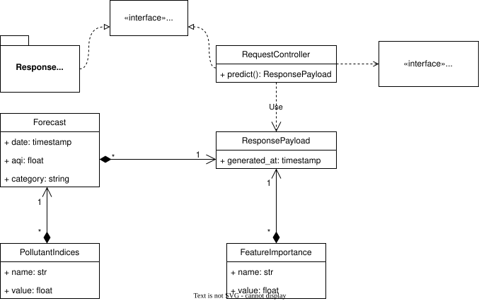

# Detailed Design

**Project:** Pearls AQI Predictor

**Version:** 1.0

**Date:** 2026-07-28

---

# Table of Contents

- [Detailed Design](#detailed-design)
- [1. Introduction](#1-introduction)
- [2. Backend Design](#2-backend-design)
  - [2.1 Responsibilities](#21-responsibilities)
  - [2.2 Internal Structure](#22-internal-structure)
  - [2.3 API Endpoints](#23-api-endpoints)
  - [2.4 Request and Response Models](#24-request-and-response-models)
- [3. Prediction Pipeline Design](#3-prediction-pipeline-design)
  - [3.1 Pipeline Workflow](#31-pipeline-workflow)
  - [3.2 Feature Retrieval](#32-feature-retrieval)
  - [3.3 Model Loading](#33-model-loading)
  - [3.4 Inference Execution](#34-inference-execution)
  - [3.5 SHAP Explanation Generation](#35-shap-explanation-generation)
  - [3.6 Response Formatting](#36-response-formatting)
- [4. Feature Engineering Pipeline Design](#4-feature-engineering-pipeline-design)
  - [4.1 Data Ingestion](#41-data-ingestion)
  - [4.2 Feature Engineering](#42-feature-engineering)
  - [4.3 Feature Validation](#43-feature-validation)
  - [4.4 Feature Store Publication](#44-feature-store-publication)
- [5. Model Training Pipeline Design](#5-model-training-pipeline-design)
  - [5.1 Dataset Construction](#51-dataset-construction)
  - [5.2 Model Training](#52-model-training)
  - [5.3 Model Evaluation](#53-model-evaluation)
  - [5.4 Model Registration](#54-model-registration)
- [6. Dashboard Design](#6-dashboard-design)
  - [6.1 User Interface Layout](#61-user-interface-layout)
  - [6.2 Prediction Workflow](#62-prediction-workflow)
  - [6.3 Visualisation Components](#63-visualisation-components)
- [7. Repository Structure](#7-repository-structure)
- [8. Design Decisions](#8-design-decisions)

---

# 1. Introduction

This document describes the detailed design of the Pearls AQI Predictor system. It expands upon the System Architecture document by specifying the internal design of the application's major components and defining how they collaborate to implement the proposed architecture.

The detailed design provides implementation-oriented specifications for the FastAPI backend, prediction pipeline, feature engineering pipeline, model training pipeline, and Streamlit dashboard. It also documents the repository organisation, internal workflows, application interfaces, and design decisions that guide the development of a modular and maintainable machine learning system.

This document serves as the technical blueprint for the implementation phase. It bridges the gap between the high-level architectural views presented in the System Architecture document and the source code that realises those designs.

---

# 2. Backend Design

This section describes the detailed design of the backend subsystem responsible for serving prediction requests. It expands upon the architectural decisions defined in the System Architecture document by specifying the backend's external interface, responsibilities, and interaction with internal machine learning components.

The backend is implemented using **FastAPI** and serves as the application's API Gateway. Its primary responsibility is to receive client requests, validate them, delegate prediction execution to the Prediction Pipeline, and return the resulting prediction payload. The backend does not perform feature retrieval, model loading, inference, AQI computation, or pollutant AQI index calculation directly. These responsibilities are encapsulated within the Prediction Pipeline in accordance with the system architecture.

---

## 2.1 Backend Class Diagram

The **RequestController** exposes the REST API endpoint and delegates prediction execution through the **PredictionPipelineAPI** interface. After receiving prediction results, the controller returns a **ResponsePayload**, which aggregates the forecasted AQI values and pollutant-specific AQI indices. The **ResponseFormatter** serializes the response into JSON before it is returned to the client.

The backend itself remains stateless and does not implement prediction logic, preserving a clear separation between request handling and machine learning execution.



**Figure 2.1.** the figure illustrates static structure of the backend subsystem. The backend consists of a lightweight controller responsible for handling HTTP requests, response data transfer objects (DTOs) used to structure prediction results, and interfaces that define communication with external components.

---

## 2.2 REST API

The backend exposes a RESTful API over HTTPS.

| Property | Value |
|----------|-------|
| Framework | FastAPI |
| Protocol | HTTPS |
| Architecture Style | REST |
| Data Format | JSON |
| Character Encoding | UTF-8 |
| Authentication | None (current version) |

---

## 2.3 Prediction Endpoint

### Endpoint

```http
POST /predict
```

### Description

Generates a three-day AQI forecast for Karachi.

Upon receiving a prediction request, the backend delegates execution to the Prediction Pipeline. The pipeline retrieves engineered features from the Hopsworks Feature Store, loads production models from the Model Registry, performs inference, computes pollutant-specific AQI indices and the overall AQI according to the US EPA methodology, generates SHAP explanations, and returns the completed prediction payload.

---

### Request

No request body is required.

Example:

```http
POST /predict HTTP/1.1
Host: pearls-aqi.example.com
```

---

### Successful Response (HTTP 200)

```json
{
  "generated_at": "2026-07-29T08:00:00Z",
  "forecast": [
    {
      "date": "2026-07-30",
      "aqi": 118,
      "category": "Unhealthy for Sensitive Groups"
    },
    {
      "date": "2026-07-31",
      "aqi": 96,
      "category": "Moderate"
    },
    {
      "date": "2026-08-01",
      "aqi": 82,
      "category": "Moderate"
    }
  ],
  "pollutant_indices": [
    {
      "name": "PM2.5",
      "value": 118
    },
    {
      "name": "O3",
      "value": 81
    },
    {
      "name": "NO2",
      "value": 42
    }
  ]
}
```

---

### Response Status Codes

| Status Code | Description |
|-------------|-------------|
| 200 | Prediction generated successfully. |
| 500 | Internal prediction pipeline failure. |
| 503 | Required feature data or production models are unavailable. |

---

## 2.4 Backend Responsibilities

The FastAPI Backend is responsible for:

- Exposing the REST API to client applications.
- Receiving and validating prediction requests.
- Delegating prediction execution to the Prediction Pipeline.
- Returning prediction results to the client.
- Translating internal exceptions into appropriate HTTP responses.
- Serializing response objects into JSON.

The backend intentionally contains minimal business logic. Feature retrieval, model loading, inference execution, AQI computation, pollutant AQI index calculation, and SHAP explanation generation are delegated to the Prediction Pipeline to preserve modularity and maintain a clear separation of concerns.