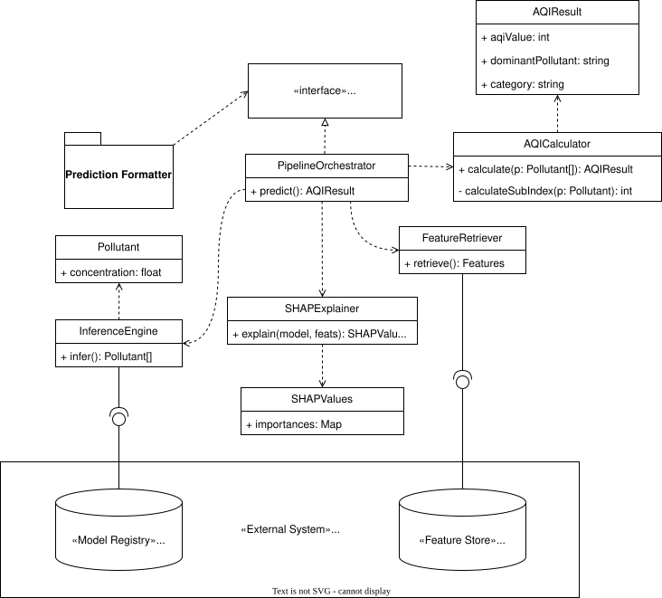
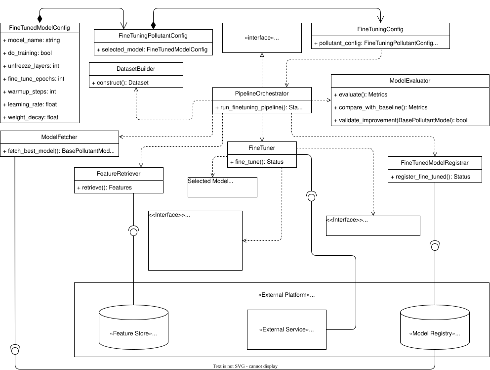

# Detailed Design

**Project:** Pearls AQI Predictor

**Version:** 1.0

**Date:** 2026-07-28

---

# Table of Contents

- [Detailed Design](#detailed-design)
- [Table of Contents](#table-of-contents)
- [1. Introduction](#1-introduction)
- [2. Backend Design](#2-backend-design)
  - [2.1 Backend Class Diagram](#21-backend-class-diagram)
  - [2.2 REST API](#22-rest-api)
  - [2.3 Prediction Endpoint](#23-prediction-endpoint)
    - [Endpoint](#endpoint)
    - [Description](#description)
    - [Request](#request)
    - [Successful Response (HTTP 200)](#successful-response-http-200)
    - [Response Status Codes](#response-status-codes)
  - [2.4 Backend Responsibilities](#24-backend-responsibilities)
- [3. Prediction Pipeline Design](#3-prediction-pipeline-design)
  - [3.1 Prediction Pipeline Class Diagram](#31-prediction-pipeline-class-diagram)
  - [3.2 Pipeline Execution Workflow](#32-pipeline-execution-workflow)
  - [3.3 Component Breakdown](#33-component-breakdown)
    - [3.3.1 FeatureRetriever](#331-featureretriever)
    - [3.3.2 InferenceEngine](#332-inferenceengine)
    - [3.3.3 SHAPExplainer](#333-shapexplainer)
    - [3.3.4 AQICalculator](#334-aqicalculator)
    - [3.3.5 PredictionFormatter](#335-predictionformatter)
  - [3.4 Pipeline Responsibilities](#34-pipeline-responsibilities)
- [4. Model Finetuning Pipeline Design](#4-model-finetuning-pipeline-design)
  - [4.1 Finetuning Pipeline Class Diagram](#41-finetuning-pipeline-class-diagram)
  - [4.2 Pipeline Execution Workflow](#42-pipeline-execution-workflow)
  - [4.3 Component Breakdown](#43-component-breakdown)
    - [4.3.1 PipelineOrchestrator \& Configuration Classes](#431-pipelineorchestrator--configuration-classes)
    - [4.3.2 ModelFetcher](#432-modelfetcher)
    - [4.3.3 FeatureRetriever \& DatasetBuilder](#433-featureretriever--datasetbuilder)
    - [4.3.4 FineTuner \& BasePollutantModel Interface](#434-finetuner--basepollutantmodel-interface)
    - [4.3.5 ModelEvaluator](#435-modelevaluator)
    - [4.3.6 FineTunedModelRegistrar](#436-finetunedmodelregistrar)
  - [4.4 Pipeline Responsibilities](#44-pipeline-responsibilities)

---

# 1. Introduction

This document describes the detailed design of the Pearls AQI Predictor system. It expands upon the System Architecture document by specifying the internal design of the application's major components and defining how they collaborate to implement the proposed architecture.

The detailed design provides implementation-oriented specifications for the FastAPI backend, prediction pipeline, feature engineering pipeline, model training pipeline, and Streamlit dashboard. It also documents the repository organisation, internal workflows, application interfaces, and design decisions that guide the development of a modular and maintainable machine learning system.

This document serves as the technical blueprint for the implementation phase. It bridges the gap between the high-level architectural views presented in the System Architecture document and the source code that realises those designs.

---

# 2. Backend Design

This section describes the detailed design of the backend subsystem responsible for serving prediction requests. It expands upon the architectural decisions defined in the System Architecture document by specifying the backend's external interface, responsibilities, and interaction with internal machine learning components.

The backend is implemented using **FastAPI** and serves as the application's API Gateway. Its primary responsibility is to receive client requests, validate them, delegate prediction execution to the Prediction Pipeline, and return the resulting prediction payload. The backend does not perform feature retrieval, model loading, inference, AQI computation, or pollutant AQI index calculation directly. These responsibilities are encapsulated within the Prediction Pipeline in accordance with the system architecture.

---

## 2.1 Backend Class Diagram

The **RequestController** exposes the REST API endpoint and delegates prediction execution through the **PredictionPipelineAPI** interface. After receiving prediction results, the controller returns a **ResponsePayload**, which aggregates the forecasted AQI values and pollutant-specific AQI indices. The **ResponseFormatter** serializes the response into JSON before it is returned to the client.

The backend itself remains stateless and does not implement prediction logic, preserving a clear separation between request handling and machine learning execution.


**Figure 2.1.** the figure illustrates static structure of the backend subsystem. The backend consists of a lightweight controller responsible for handling HTTP requests, response data transfer objects (DTOs) used to structure prediction results, and interfaces that define communication with external components.

---

## 2.2 REST API

The backend exposes a RESTful API over HTTPS.

| Property | Value |
|----------|-------|
| Framework | FastAPI |
| Protocol | HTTPS |
| Architecture Style | REST |
| Data Format | JSON |
| Character Encoding | UTF-8 |
| Authentication | None (current version) |

---

## 2.3 Prediction Endpoint

### Endpoint

```http
POST /predict
```

### Description

Generates a three-day AQI forecast for Karachi.

Upon receiving a prediction request, the backend delegates execution to the Prediction Pipeline. The pipeline retrieves engineered features from the Hopsworks Feature Store, loads production models from the Model Registry, performs inference, computes pollutant-specific AQI indices and the overall AQI according to the US EPA methodology, generates SHAP explanations, and returns the completed prediction payload.

---

### Request

No request body is required.

Example:

```http
POST /predict HTTP/1.1
Host: pearls-aqi.example.com
```

---

### Successful Response (HTTP 200)

```json
{
  "generated_at": "2026-07-29T08:00:00Z",
  "forecast": [
    {
      "date": "2026-07-30",
      "aqi": 118,
      "category": "Unhealthy for Sensitive Groups"
    },
    {
      "date": "2026-07-31",
      "aqi": 96,
      "category": "Moderate"
    },
    {
      "date": "2026-08-01",
      "aqi": 82,
      "category": "Moderate"
    }
  ],
  "pollutant_indices": [
    {
      "name": "PM2.5",
      "value": 118
    },
    {
      "name": "O3",
      "value": 81
    },
    {
      "name": "NO2",
      "value": 42
    }
  ]
}
```

---

### Response Status Codes

| Status Code | Description |
|-------------|-------------|
| 200 | Prediction generated successfully. |
| 500 | Internal prediction pipeline failure. |
| 503 | Required feature data or production models are unavailable. |

---

## 2.4 Backend Responsibilities

The FastAPI Backend is responsible for:

- Exposing the REST API to client applications.
- Receiving and validating prediction requests.
- Delegating prediction execution to the Prediction Pipeline.
- Returning prediction results to the client.
- Translating internal exceptions into appropriate HTTP responses.
- Serializing response objects into JSON.

The backend intentionally contains minimal business logic. Feature retrieval, model loading, inference execution, AQI computation, pollutant AQI index calculation, and SHAP explanation generation are delegated to the Prediction Pipeline to preserve modularity and maintain a clear separation of concerns.

---

# 3. Prediction Pipeline Design

This section describes the detailed design of the Prediction Pipeline subsystem, which is responsible for executing online inference. The Prediction Pipeline encapsulates all machine learning operational logic, separating inference, feature retrieval, explainability, and index calculations from the web server layer.

Upon invocation by the Backend API Gateway or CLI, the pipeline connects to external cloud services to fetch the required feature data and model artifacts, generates concentration predictions for target atmospheric pollutants, calculates overall and pollutant-specific Air Quality Index (AQI) values, generates SHAP feature attribution explanations, and constructs the unified response payload.

---

## 3.1 Prediction Pipeline Class Diagram

The Prediction Pipeline uses an orchestrator pattern centered around the `PipelineOrchestrator`, which implements the `PredictionPipelineAPI` interface. The orchestrator manages execution across specialized modular components: `FeatureRetriever`, `InferenceEngine`, `SHAPExplainer`, `AQICalculator`, and `PredictionFormatter`.

External infrastructure interactions are encapsulated via interfaces (`FeatureStoreInterface` and `ModelRegistryInterface`), enabling robust testing and decoupling from direct vendor dependencies.



**Figure 3.1.** Static structure of the Prediction Pipeline subsystem. The pipeline uses an orchestrator to coordinate feature retrieval, multi-pollutant model inference, SHAP feature importance calculation, EPA AQI breakpoint conversion, and response formatting.

---

## 3.2 Pipeline Execution Workflow

The end-to-end execution of the prediction process follows a linear operational workflow across the pipeline components:

1. **Invocation**: The `PipelineOrchestrator` receives a forecast request via `predict()`.
2. **Feature Retrieval**: The `FeatureRetriever` connects to the Hopsworks Feature Store to fetch the latest engineered feature vector containing current and lagged meteorological and atmospheric variables.
3. **Model Loading & Inference**: The `InferenceEngine` retrieves the active production model artifacts from the Hopsworks Model Registry and executes batch model inference to output raw pollutant concentrations ($PM_{2.5}, PM_{10}, O_3, NO_2, SO_2, CO$).
4. **SHAP Explanation**: The `SHAPExplainer` calculates additive feature attribution values (SHAP scores) to identify key environmental drivers influencing the model predictions.
5. **AQI Calculation**: The `AQICalculator` transforms concentration predictions into pollutant-specific sub-indices using standard US EPA linear breakpoint equations, identifying the dominant pollutant and overall AQI score.
6. **Response Formatting**: The `PredictionFormatter` converts internal domain objects (`AQIResult`, `SHAPValues`, `Pollutant`) into the final structured `ResponsePayload` DTO ready for serialization.

---

## 3.3 Component Breakdown

### 3.3.1 FeatureRetriever

The `FeatureRetriever` acts as the data access client for online prediction inputs.

* **Primary Responsibility**: Connects to the Hopsworks Feature Store API using configured credentials and retrieves the latest online feature view snapshot for Karachi.
* **Data Returned**: Formatted Pandas DataFrames / NumPy arrays containing lag features (e.g., 1h, 3h, 24h pollutant readings) and current weather observations (temperature, relative humidity, wind speed, surface pressure).
* **Error Handling**: Raises a `FeatureStoreUnavailableException` if connection timeouts occur or if feature vectors are missing required schema variables.

---

### 3.3.2 InferenceEngine

The `InferenceEngine` manages model artifact loading and prediction execution.

* **Primary Responsibility**: Downloads or loads cached production models from the Hopsworks Model Registry corresponding to each target pollutant.
* **Execution Flow**: Evaluates candidate feature arrays against fitted model pipelines (e.g., XGBoost, LightGBM, PyTorch neural networks) to generate multi-step forecasted concentrations ($\mu g/m^3$ or $ppm$) for the target forecast horizon.
* **Output**: A collection of structured `Pollutant` domain models storing pollutant names, forecast timestamps, and predicted numeric values.

---

### 3.3.3 SHAPExplainer

The `SHAPExplainer` provides local model interpretability for generated predictions.

* **Primary Responsibility**: Computes SHAP (SHapley Additive exPlanations) values to quantify the contribution of each input feature to the predicted concentration level.
* **Implementation**: Utilizes model-appropriate explainers (e.g., `TreeExplainer` for tree ensembles, `KernelExplainer` for general functions) initialized with baseline background distributions from training data.
* **Output**: `SHAPValues` DTO containing feature importance vectors and directional impact indicators (positive/negative impact on air pollution levels).

---

### 3.3.4 AQICalculator

The `AQICalculator` implements the mathematical translation from raw concentration metrics into standardized public health indices according to United States Environmental Protection Agency (US EPA) specifications.

* **Sub-Index Formula**: Uses piecewise linear interpolation based on pollutant breakpoint bounds:
$$I_p = \frac{I_{Hi} - I_{Lo}}{BP_{Hi} - BP_{Lo}} (C_p - BP_{Lo}) + I_{Lo}$$


Where:
* $I_p$ = Index value for pollutant $p$
* $C_p$ = Truncated concentration of pollutant $p$
* $BP_{Hi}, BP_{Lo}$ = Breakpoint concentration bounds containing $C_p$
* $I_{Hi}, I_{Lo}$ = AQI index bounds corresponding to $BP_{Hi}, BP_{Lo}$


* **Overall AQI Derivation**: The overall AQI score is assigned as the maximum sub-index across all evaluated pollutants:
$$AQI = \max (I_{PM2.5}, I_{PM10}, I_{O3}, I_{NO2}, I_{SO2}, I_{CO})$$


* **Category Mapping**: Maps numerical scores into standardized public health advisory bands:
* `0 - 50`: Good
* `51 - 100`: Moderate
* `101 - 150`: Unhealthy for Sensitive Groups
* `151 - 200`: Unhealthy
* `201 - 300`: Very Unhealthy
* `301 - 500`: Hazardous


---

### 3.3.5 PredictionFormatter

The `PredictionFormatter` acts as the mapping layer between internal pipeline models and external communication schemas.

* **Primary Responsibility**: Transforms `AQIResult`, `Pollutant`, and `SHAPValues` objects into a standardized `ResponsePayload`.
* **Output**: Ensures target dates, forecast intervals, pollutant sub-indices, categorical labels, and feature importance mappings conform strictly to the expected JSON schema specified by the API Gateway layer.

---

## 3.4 Pipeline Responsibilities

The Prediction Pipeline is strictly responsible for:

* Managing connections to the Hopsworks Feature Store and Model Registry.
* Validating the integrity of incoming feature vectors prior to model inference.
* Loading, caching, and executing production machine learning models.
* Computing pollutant sub-indices and overall AQI values according to US EPA standards.
* Calculating SHAP feature attributions for model interpretability.
* Packaging forecast figures, metadata, and SHAP explainability attributes into standardized domain payloads.

---

# 4. Model Finetuning Pipeline Design

This section describes the detailed design of the Model Finetuning Pipeline subsystem, which is responsible for performing incremental retraining and fine-tuning on active production baseline models using newly ingested atmospheric feature observations.

The pipeline ensures continuous model adaptation without requiring retraining from scratch. It retrieves production artifacts from the Model Registry, fine-tunes parameters based on updated feature store batches, evaluates metrics against baseline models, logs experiments to MLflow, and registers improved models back into the Hopsworks Model Registry.

---

## 4.1 Finetuning Pipeline Class Diagram

The Model Finetuning Pipeline uses an orchestrator pattern centered around the **PipelineOrchestrator**, which implements the **FineTuningPipelineInterface**. The orchestrator manages interactions between configuration classes (**FineTuningConfig**, **FineTuningPollutantConfig**, **FineTunedModelConfig**), data ingestion modules (**FeatureRetriever**, **DatasetBuilder**), retraining engines (**ModelFetcher**, **FineTuner**, **Callbacks**), and validation/registration handlers (**ModelEvaluator**, **FineTunedModelRegistrar**).

External connections to the **AQI Feature Store**, **MLflow Tracking Server**, and **AQI Model Registry** on the **Hopsworks Platform** are managed via dedicated adapter interfaces.



**Figure 4.1.** Static structure of the Model Finetuning Pipeline subsystem. The pipeline orchestrator manages baseline model retrieval, feature batch dataset construction, adapter/layer fine-tuning, MLflow callback tracking, performance validation against baseline models, and conditional model registration in Hopsworks.

---

## 4.2 Pipeline Execution Workflow

The operational flow of the fine-tuning execution follows a structured, multi-step process:

1. **Invocation**: The `PipelineOrchestrator` receives an execution trigger via `run_finetuning_pipeline()`, taking a structured `FineTuningConfig` payload.
2. **Model Fetching**: The `ModelFetcher` queries the **AQI Model Registry** on Hopsworks via `fetch_best_model()` to download the active production baseline model conforming to the `BasePollutantModel` interface.
3. **Feature Ingestion & Dataset Construction**:
   * The `FeatureRetriever` executes `retrieve()` against the **AQI Feature Store** to pull newly updated feature records.
   * The `DatasetBuilder` processes feature vectors via `construct()` to construct a structured `Dataset` tailored for fine-tuning.


4. **Incremental Retraining & Experiment Tracking**:
   * The `FineTuner` receives hyperparameters from `FineTunedModelConfig` (such as `unfreeze_layers`, `fine_tune_epochs`, `learning_rate`, `weight_decay`, and `warmup_steps`).
   * Retraining is initiated via `fine_tune()`, invoking `fine_tune(dataset)` on the `BasePollutantModel` and logging parameters, metrics, and adapter checkpoints to the **MLflow Tracking Server** via the `Callbacks` interface.


5. **Model Evaluation & Comparison**:
   * The `ModelEvaluator` executes `evaluate()` and `compare_with_baseline()` to compute comparative evaluation metrics.
   * The `validate_improvement(BasePollutantModel)` method determines if the fine-tuned candidate outperforms the current production baseline.


6. **Model Registration**: If performance improvement is validated, the `FineTunedModelRegistrar` executes `register_fine_tuned()` to publish updated model weights and adapters (`save_adapter()`) to the **AQI Model Registry**.

---

## 4.3 Component Breakdown

### 4.3.1 PipelineOrchestrator & Configuration Classes

The orchestrator and configuration DTOs define fine-tuning parameters across all evaluated atmospheric pollutants ($PM_{2.5}, PM_{10}, O_3, NO_2, SO_2, CO$).

* **FineTuningConfig**: Container class aggregating `pollutant_config` settings for each pollutant model.
* **FineTuningPollutantConfig**: Holds pollutant-specific settings and wraps the selected model configuration (`selected_model`).
* **FineTunedModelConfig**: Defines model-level fine-tuning hyperparameters:
* `model_name`: Identifies the target model artifact.
* `do_training`: Boolean flag toggling fine-tuning execution.
* `unfreeze_layers`: Integer specifying top layer count to unfreeze for gradient updates.
* `fine_tune_epochs`: Number of incremental training epochs.
* `warmup_steps`: Number of initial learning rate warmup iterations.
* `learning_rate`: Floating-point step size for gradient updates.
* `weight_decay`: Regularization parameter preventing catastrophic forgetting.


---

### 4.3.2 ModelFetcher

The `ModelFetcher` isolates model retrieval operations from the Hopsworks Model Registry.

* **Primary Responsibility**: Queries the **AQI Model Registry** to retrieve the latest production baseline model.
* **Methods**:
* `fetch_best_model(): BasePollutantModel`: Downloads model binaries, configurations, and adapter states from Hopsworks and returns an instantiated object implementing the `BasePollutantModel` interface.


---

### 4.3.3 FeatureRetriever & DatasetBuilder

These components prepare newly ingested feature batches for model adaptation.

* **FeatureRetriever**:
* `retrieve(): Features`: Queries the **AQI Feature Store** for recent feature group entries containing new meteorological and pollutant observations.


* **DatasetBuilder**:
* `construct(): Dataset`: Merges retrieved features, performs temporal sequence alignment, handles missing values, and builds `Dataset` objects optimized for fine-tuning.


---

### 4.3.4 FineTuner & BasePollutantModel Interface

The core training execution engine handles parameter updates and adapter state saving.

* **FineTuner**:
* `fine_tune(): Status`: Manages execution across fine-tuning epochs, delegating parameter optimization to the underlying model and streaming progress metrics through `Callbacks`.


* **BasePollutantModel Interface**:
* `config: FineTuningConfig`: Property storing active fine-tuning configuration parameters.
* `fine_tune(dataset): Metrics`: Executes gradient updates or incremental boosting steps on target model layers, returning training evaluation metrics.
* `predict(X): ndarray`: Computes predictions on input feature arrays.
* `save_adapter(path): Path`: Exports fine-tuned parameter weights or adapter artifacts to local storage prior to registration.


---

### 4.3.5 ModelEvaluator

The `ModelEvaluator` provides validation checks before candidate models can be promoted.

* **Methods**:
* `evaluate(): Metrics`: Calculates evaluation metrics (RMSE, MAE, $R^2$) on fine-tuning validation splits.
* `compare_with_baseline(): Metrics`: Computes relative performance gain or degradation against the active production model.
* `validate_improvement(BasePollutantModel): bool`: Returns `True` if performance gains satisfy predefined acceptance thresholds, preventing degraded models from entering production.


---

### 4.3.6 FineTunedModelRegistrar

The `FineTunedModelRegistrar` handles version control and deployment candidate updates.

* **Primary Responsibility**: Commits validated fine-tuned models and adapter weights to the **AQI Model Registry**.
* **Methods**:
* `register_fine_tuned(): Status`: Uploads model artifacts, associated metrics, and dependency schemas to Hopsworks, tagging the model version as the new active baseline.


---

## 4.4 Pipeline Responsibilities 

The Model Finetuning Pipeline is strictly responsible for:

* Fetching production models from the Hopsworks Model Registry for incremental adaptation.
* Retrieving new feature observations from the Hopsworks Feature Store to construct fine-tuning datasets.
* Managing hyperparameter settings (unfrozen layers, learning rates, weight decay, warmup steps) per pollutant model.
* Streaming epoch-level metrics and loss logs to the MLflow Tracking Server.
* Validating candidate model performance against production baselines using strict acceptance criteria.
* Registering updated model adapters and artifacts back into the Hopsworks Model Registry.

